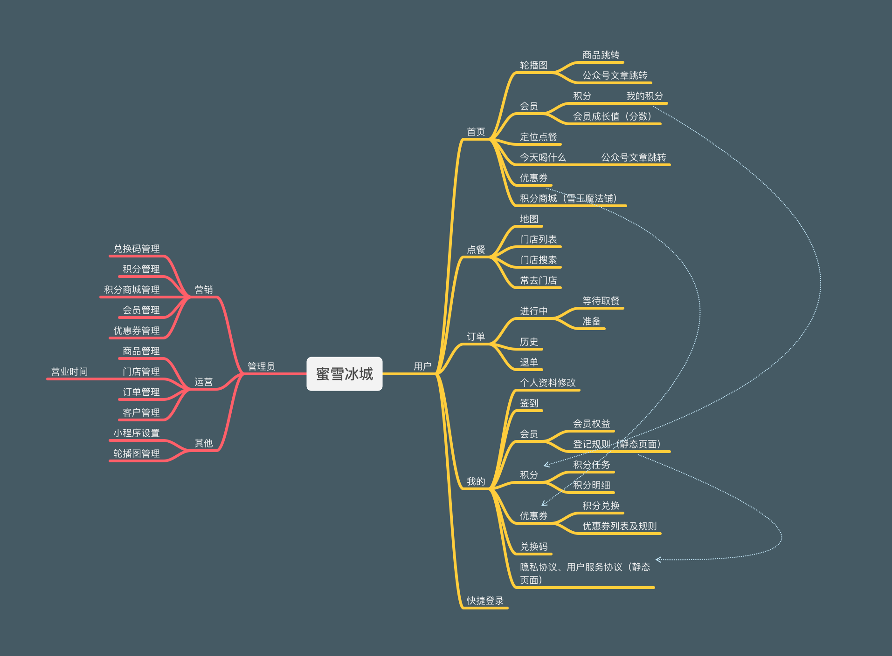

## 初始化项目

#### 创建项目

1. 使用测试号登录选用 TypeScript + Sass 版本的模板，进入项目

2. 先创建底部导航部分

*app.json*

```js
   {
     "pages": [
       "pages/index/index",
       "pages/menu/index",
       "pages/order/index",
       "pages/me/index"
     ],
     "window": {
       "backgroundTextStyle": "light",
       "navigationBarBackgroundColor": "#fff",
       "navigationBarTitleText": "Weixin",
       "navigationBarTextStyle": "black"
     },
     "tabBar": {
       "list": [
         {
           "pagePath": "pages/index/index",
           "text": "首页"
         },
         {
           "pagePath": "pages/menu/index",
           "text": "点餐"
         },
         {
           "pagePath": "pages/order/index",
           "text": "订单"
         },
         {
           "pagePath": "pages/me/index",
           "text": "我的"
         }
       ]
     },
     "style": "v2",
     "sitemapLocation": "sitemap.json"
   }
```

#### 首页轮播图和轮播图页面的跳转

1. project.config.json 中的 TypeScript 删除和 app.js 中的语法错误删除

```js
// project.config.json

"setting": {
    "useCompilerPlugins": [
      // "typescript",
      "sass"
    ],
        
// app.js 
App<IAppOption>({   -->   APP({})
```

2. pages/index/index.json

```js
{
  "navigationStyle": "custom"
} 
// 取消头部导航栏部分，这样就可以撑满整个屏幕
```

3.  pages/index/index.wxml

```html
   <view class="page">
    <view class="swiper-container">
     <swiper>
      <!-- 轮播里面包括图片，里面一个是轮播一个是轮播标识，里面一个是图片一个是跳转链接 mode="aspectFill" 防止图片变形-->
       <swiper-item wx:for="{{ swiperList }}" wx:key="index">
         <image mode="aspectFill" src="{{ item.imageUrl }}"></image>
       </swiper-item>
     </swiper>
     <view class="dots">
     <!-- 如果 current == index  会有一个 active 属性-->
         
     <view class="dot {{current !== index || 'active'}}" wx:for="{{ swiperList }}" wx:key="index"></view>
     </view>
    </view>
</view>
```

4. pages/index/index.scss

```js
.swiper-container{
  width: 100vw;
  height: 630rpx;
  swiper{
    height: 100%;
    image{
      width: 100%;
      height: 100%;
    }
  }
}
```

###### 实现轮播图页面按钮样式切换

5. pages/index/index.wxml

```html
<view class="page">
 <view class="swiper-container">
 <!--3. 我们怎么知道图片切换去切换小圆圈的状态呢，这里有个bindchange事件 -->
  <swiper bindchange="onSwiperChange">
   <!--1. 轮播里面包括图片，里面一个是轮播一个是轮播标识，里面一个是图片一个是跳转链接 -->
    <swiper-item wx:for="{{ swiperList }}" wx:key="index">
      <image mode="aspectFill" src="{{ item.imageUrl }}"></image>
    </swiper-item>
  </swiper>
  <view class="dots">
  <!--2. 如果 current == index  会有一个 active 属性-->
  <view class="dot {{current !== index || 'active'}}" wx:for="{{ swiperList }}" wx:key="index"></view>
  </view>
 </view>
</view>
```

6. pages/index/index.scss

```scss
.swiper-container{
  width: 100vw;
  height: 630rpx;
  position: relative;
  swiper{
    height: 100%;
    image{
      width: 100%;
      height: 100%;
      // 下面有一点的弧度
      border-bottom-left-radius: 20rpx;
      border-bottom-right-radius: 20rpx;
    }
  }
  // 固定的区域，轮播图里面的切换图片的小标识
  .dots{
    position: absolute;
    left: 50rpx;
    bottom: 50rpx;
    // 这样的话下面的 dot 小圆圈就可以按照flex进行排布
    display: inline-flex;
    .dot{
      width: 8rpx;
      height: 8rpx;
      background-color: #fff;
      opacity: .5;
      // 因为上面是正方块，所以这里应该是半径 4rpx 的圆
      border-radius: 4rpx;
      // 每个小圆的间隔是 4rpx
      margin-left: 4rpx;
      // 1s 过渡
      transition: all 1s;
      &.active {
        // 如果是被选中状态的话，那么这里就会从圆变成一个条状的切换样式
        width: 29rpx;
        opacity: 1;
      }
    }
  }
}
```

7. pages/index/index.js

```js
// pages/index/index.ts
Page({

  /**
   * 页面的初始数据
   */
  data: {
    swiperList:[
      {
        imageUrl:'../../assets/images/lb1.png',
        type:'url',
        target:"http://baidu.com"
      },
      {
        imageUrl:'../../assets/images/lb2.png',
        // 跳转到产品具体的详情页
        type:'product',
        target:"1"
      },
      {
        imageUrl:'../../assets/images/lb3.png',
        type:'url',
        target:"http://baidu.com"
      }
    ],
    current:0
  },
  // 当轮播图切换的时候，调用这个方法，给 current 重新赋值，改变切换按钮的样式
  onSwiperChange(e){
    // 可以先进行解构，将里面的 current 拿出来
    const { current } = e.detail
    this.setData({
      current
    })
  }
})
```

##### 使用云开发的方式存储数据

1. 云开发-内容管理-访问地址-创建新项目蜜雪冰城-内容模型-新建模型

   ```js
   // 1.内容类型 图片
   1. 展示名称：轮播图
   2. 数据库字段名：imgUri
   3. 资源链接格式：HTTPS
   4. 是否必须：开启
   // 2.内容类型 枚举
   1. 展示名称：跳转类型
   2. 数据库字段名：type
   3. 资源链接格式：url
   4. 枚举元素类型：字符串
   5. 枚举元素：
     5.1 网址 url
     5.2 产品 product
   6. 是否必须：开启
   // 3. 内容类型 单行字符串
   1. 展示名称：目标
   2. 数据库字段名：target
   3. 是否必须：开启
   ```

2. 内容集合-轮播图-新建

   ```js
   1. 传入图片 
   跳转类型：网址 
   目标：https://baodu.com
   2. 传入图片 
   跳转类型：产品
   目标：123
   3. 传入图片
   跳转类型：产品
   目标：2
   ```

3. 获取云开发数据库中的数据

   api/swiper.js

   ```js
   // 这里是获取 swiper 的方式，简答的封装了一层API，获取数据可以通过这种方式获取
   // 但是这样定义之前需要先在 app.js 里面初始化
   import {db} from './cloud-init'
   const list = () => {
     return db.collection('mx_swiper').get();
   }
   
   export default {
     list
   }
   ```

   app.js

   ```js
   // app.ts
   App({
     globalData: {},
     onLaunch() {
       // 初始 cloud 功能，初始一下环境，才能调用方法 const db = wx.cloud.database() 去调用数据库
       wx.cloud.init();
   
       // 展示本地存储能力
       const logs = wx.getStorageSync('logs') || []
       logs.unshift(Date.now())
       wx.setStorageSync('logs', logs)
    
       // 登录
       wx.login({
         success: res => {
           console.log(res.code)
           // 发送 res.code 到后台换取 openId, sessionKey, unionId
         },
       })
     },
   })
   ```

   pages/index/index.js

   ```js
   import swiper from "../../api/swiper"
   
   // pages/index/index.ts
   Page({
     data: {
       // 创建一个空的数组元素   
       swiperList:[],
       current:0
     },
     // 当轮播图切换的时候，调用这个方法，给 current 重新赋值，改变切换按钮的样式
     onSwiperChange(e){
       // 可以先进行解构，将里面的 current 拿出来
       const { current } = e.detail
       this.setData({
         current
       })
     },
     /**
      * 生命周期函数--监听页面加载
      */
     onLoad() {
     // 在这里获取图片，我们通过在 api 里面封装了API，获取云开发中的数据
      swiper.list().then(res=>{
       // console.log(res);
        this.setData({
          swiperList:res.data
        })
      })
     }
   })
   ```

   pages/index/index.wxml

   ```html
   <view class="page">
   <!-- 如果 swiperList 里面没有数据不会渲染轮播图-->
    <view wx:if="{{swiperList.length}}" class="swiper-container">
    <!--3. 我们怎么知道图片切换去切换小圆圈的状态呢，这里有个bindchange事件 -->
     <swiper bindchange="onSwiperChange">
      <!--1. 轮播里面包括图片，里面一个是轮播一个是轮播标识，里面一个是图片一个是跳转链接 -->
       <swiper-item wx:for="{{ swiperList }}" wx:key="index">
         <image mode="aspectFill" src="{{ item.imgUri }}"></image>
       </swiper-item>
     </swiper>
     <view class="dots">
     <!--2. 如果 current == index  会有一个 active 属性-->
     <view class="dot {{current !== index || 'active'}}" wx:for="{{ swiperList }}" wx:key="index"></view>
     </view>
    </view>
   </view>
   ```

##### 实现轮播图的跳转功能

1. pages/index/index.wxml

   ```html
   <view class="page">
    <view wx:if="{{swiperList.length}}" class="swiper-container">
     <swiper bindchange="onSwiperChange">
       <swiper-item wx:for="{{ swiperList }}" wx:key="index">
        <!--绑定一个点击事件，并且把数据item传入，因为后续要对item里面的数据类型进行判断是如何进行跳转的-->   
         <image bindtap="onSwiperTab" data-item="{{item}}" mode="aspectFill" src="{{ item.imgUri }}"></image>
       </swiper-item>
     </swiper>
     <view class="dots">
     <view class="dot {{current !== index || 'active'}}" wx:for="{{ swiperList }}" wx:key="index"></view>
     </view>
    </view>
   </view>
   ```

2. pages/index/index.js

   ```js
   import swiper from "../../api/swiper"
   
   // pages/index/index.ts
   Page({
     data: {
       swiperList:[],
       current:0
     },
     //1. 当轮播图切换的时候，调用这个方法，给 current 重新赋值，改变切换按钮的样式
     onSwiperChange(e){
       // 可以先进行解构，将里面的 current 拿出来
       const { current } = e.detail
       this.setData({
         current
       })
     },
       
     // 轮播图的跳转效果，这里首先对其进行判断
     // 2. 当手指点图片的时候跳转页面
     onSwiperTab(e){
       // 获取传过来的数据，item
       const {item} = e.currentTarget.dataset
       // console.log(item);
       // 如果里面类型是type，说明是跳转的url，走第一个选项，如果不是走第二个
       item.type === 'url' ? wx.navigateTo({
         url: `/pages/web-view/index?url=${item.target}`,
       }) : wx.navigateTo({
         url: `/pages/product/detail?id=${item.target}`,
       })
     },
   
     onLoad() {
     // 在这里获取图片，我们通过在 api 里面封装了API，获取云开发中的数据
      swiper.list().then(res=>{
       // console.log(res);
        this.setData({
          swiperList:res.data
        })
      })
     }
   })
   ```

3. 创建两张页面 app.json

   ```js
   {
     "pages": [
       "pages/index/index",
       "pages/menu/index",
       "pages/order/index",
       "pages/me/index",
         
       // 创建出来两个需要跳转的页面
       "pages/web-view/index",
       "pages/product/detail"
     ],
     "window": {
       "backgroundTextStyle": "light",
       "navigationBarBackgroundColor": "#fff",
       "navigationBarTitleText": "Weixin",
       "navigationBarTextStyle": "black"
     },
     "tabBar": {
       "list": [
         {
           "pagePath": "pages/index/index",
           "text": "首页"
         },
         {
           "pagePath": "pages/menu/index",
           "text": "点餐"
         },
         {
           "pagePath": "pages/order/index",
           "text": "订单"
         },
         {
           "pagePath": "pages/me/index",
           "text": "我的"
         }
       ]
     },
     "style": "v2",
     "sitemapLocation": "sitemap.json"
   }
   ```

4. 获取需要跳转到的 url      pages/web-view/index.js

   ```js
    // pages/web-view/index.js
    Page({
      data: {
        url:null
      },

      onLoad(options) {
        // console.log(options.url); // 这里地址就过来了,地址赋值给上面data里面的url
        this.setData({
          url:options.url
        })
      }
    })
   ```

5. 设置跳转到的页面里面   pages/web-view/index.wxml

   ```js
	<view wx:if="{{url}}" src="{{url}}"></view>
   ```

